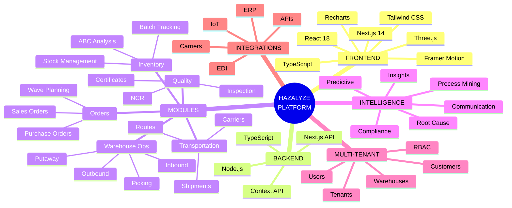
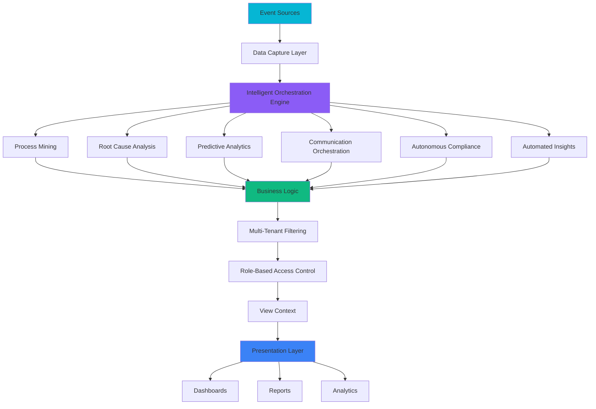
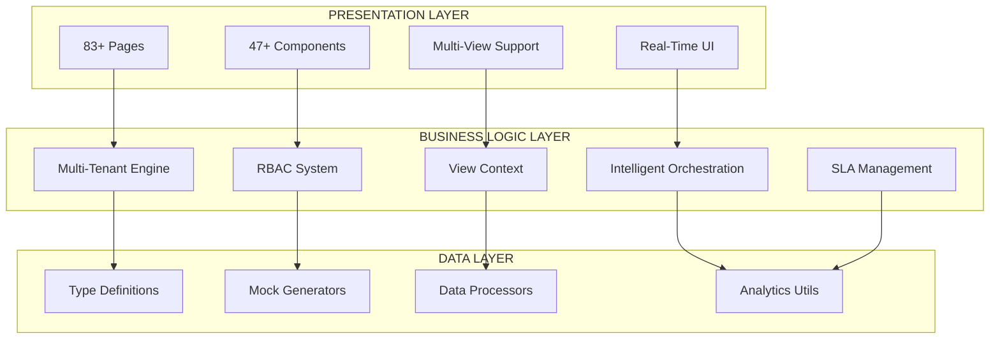
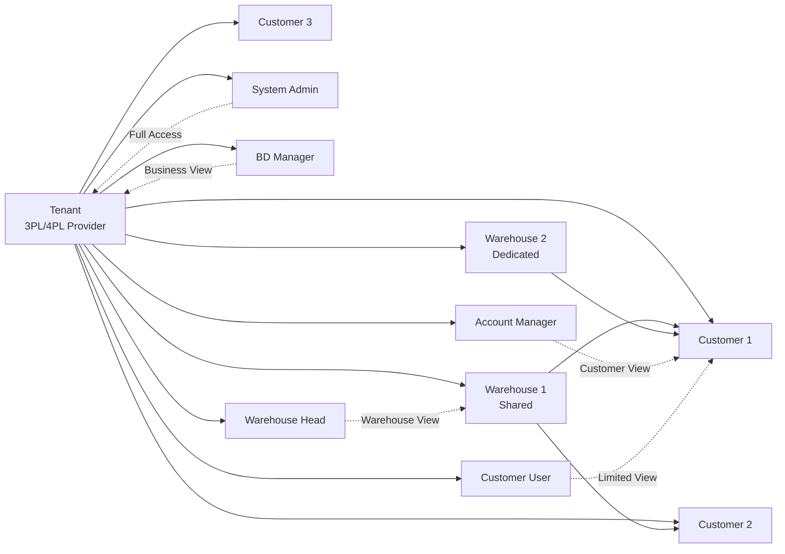
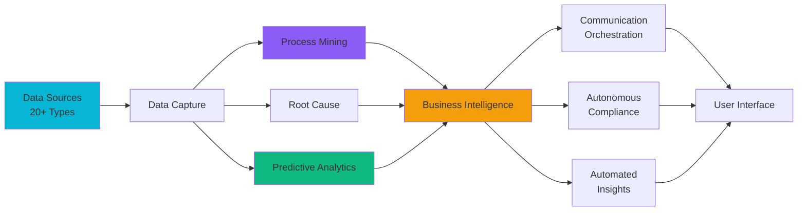
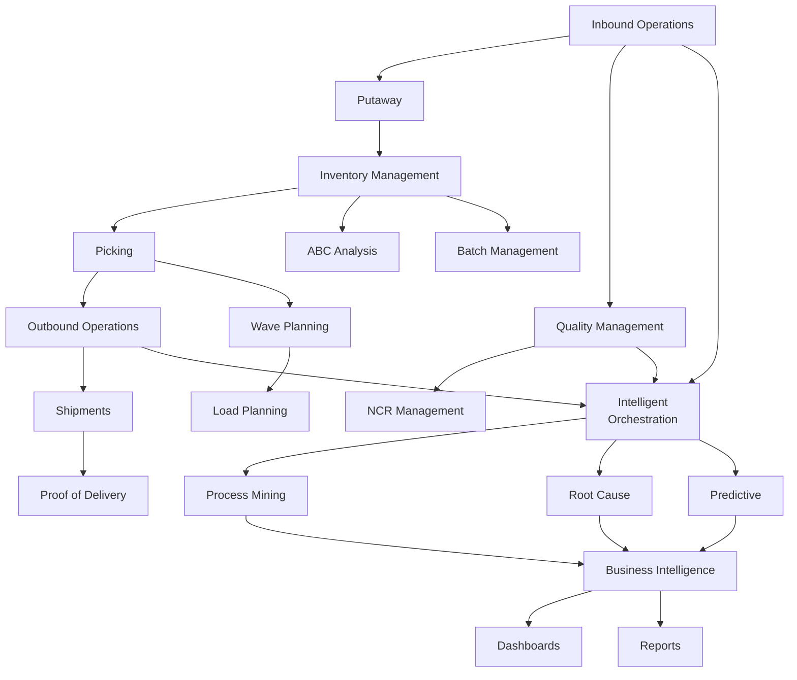
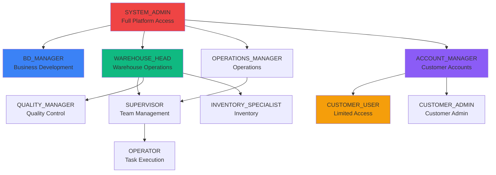
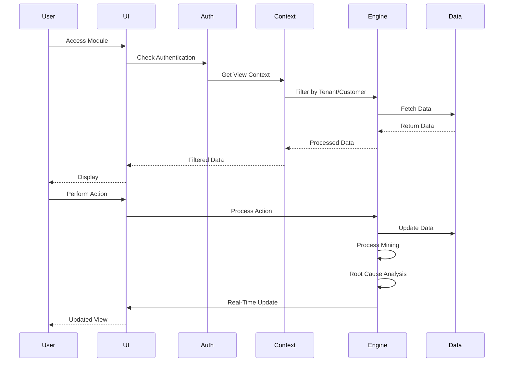
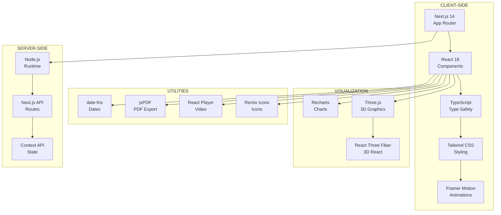

# 🎨 Visual Architecture Diagrams
## Interactive Mind Map & Process Flows

---

## 🌐 **SYSTEM OVERVIEW MIND MAP**



---

## 🔄 **PROCESS FLOW DIAGRAM**



---

## 🏗️ **ARCHITECTURE LAYERS**



---

## 🔐 **MULTI-TENANT ARCHITECTURE**



---

## 🧠 **INTELLIGENT ORCHESTRATION FLOW**



---

## 📊 **MODULE DEPENDENCY MAP**



---

## 🎯 **USER ROLE HIERARCHY**



---

## 🔄 **DATA FLOW - COMPLETE CYCLE**



---

## 🎨 **TECH STACK VISUALIZATION**



---

## 📈 **CAPABILITY MATRIX**

| Capability | Status | Complexity | AI-Powered |
|------------|--------|------------|------------|
| Inbound Operations | ✅ Complete | High | Partial |
| Outbound Operations | ✅ Complete | High | Partial |
| Inventory Management | ✅ Complete | Medium | No |
| Order Management | ✅ Complete | Medium | Partial |
| Quality Management | ✅ Complete | Medium | Partial |
| Transportation | ✅ Complete | Medium | No |
| Process Mining | ✅ Complete | High | ✅ Yes |
| Root Cause Analysis | ✅ Complete | High | ✅ Yes |
| Predictive Analytics | ✅ Complete | High | ✅ Yes |
| Communication Orchestration | ✅ Complete | Medium | ✅ Yes |
| Autonomous Compliance | ✅ Complete | High | ✅ Yes |
| Automated Insights | ✅ Complete | High | ✅ Yes |
| Multi-Tenant | ✅ Complete | High | No |
| RBAC | ✅ Complete | Medium | No |
| Business Intelligence | ✅ Complete | High | Partial |

---

## 🚀 **DEPLOYMENT ARCHITECTURE**

```
┌─────────────────────────────────────────────────────────────┐
│                    DEPLOYMENT STACK                           │
└─────────────────────────────────────────────────────────────┘

PRODUCTION ENVIRONMENT
├── Hosting: Vercel / AWS / Azure (Next.js Compatible)
├── Database: (To be integrated - PostgreSQL/MongoDB)
├── CDN: Next.js Automatic CDN
├── Caching: Next.js Built-in Caching
└── Monitoring: (To be integrated)

DEVELOPMENT ENVIRONMENT
├── Local: npm run dev (localhost:3000)
├── Hot Reload: Enabled
├── Type Checking: TypeScript
└── Linting: ESLint

BUILD PROCESS
├── npm run build → Production Build
├── npm run start → Production Server
└── Static Export: Supported
```

---

## 📱 **RESPONSIVE DESIGN BREAKPOINTS**

```
MOBILE FIRST APPROACH
├── Mobile: < 768px (sm)
├── Tablet: 768px - 1024px (md)
├── Desktop: 1024px - 1280px (lg)
└── Large Desktop: > 1280px (xl)

GRID LAYOUTS
├── Mobile: 1 column
├── Tablet: 2 columns
├── Desktop: 3-4 columns
└── Large: 4-6 columns
```

---

**This document provides a complete overview of your application architecture, capabilities, and tech stack!**


